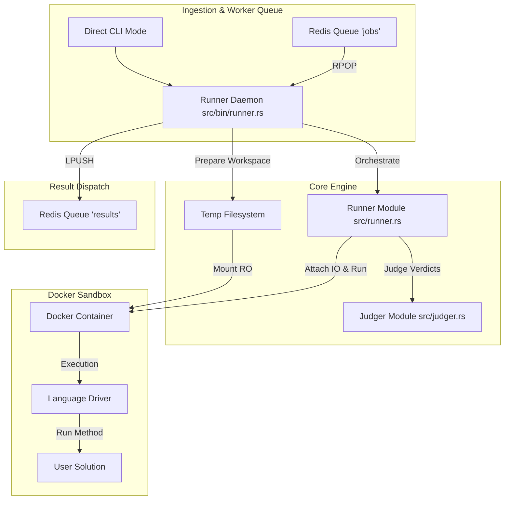

# Tally Architectural & Code Quality Review

> **Project**: Tally Code Execution Sandbox & Online Judger  
> **Repository**: [tally](file:///Users/milan/Documents/Desk/others/tally)  
> **Review Date**: July 2026  
> **Evaluator**: Antigravity AI (Pair Programmer & Software Architect)

---

## Executive Summary

**Tally** is a Rust-based online code judging system that runs user submissions for LeetCode-style algorithmic problems inside Docker sandboxes across Python, Java, C, and C++.

Overall, the architecture demonstrates **solid core design principles**:
- Good separation between the pure judging logic ([`src/judger.rs`](file:///Users/milan/Documents/Desk/others/tally/src/judger.rs)) and container orchestration ([`src/runner.rs`](file:///Users/milan/Documents/Desk/others/tally/src/runner.rs)).
- Strict Docker resource boundaries (512 MB memory limit, disabled swap, `network_mode: none`, read-only volume mounts).
- Stream-based judging with early termination on the first non-`Accepted` verdict.

However, a detailed architectural review reveals **critical scalability bottlenecks, security gaps, and maintainability issues** that limit its production readiness under high concurrent load.

---

## Architectural Overview

The system architecture consists of 4 main layers:



---

## Detailed Evaluation Dimensions

### 1. Scalability & Performance

| Metric / Aspect | Current Implementation | Rating | Scalability Assessment |
| :--- | :--- | :---: | :--- |
| **Worker Concurrency** | Single-threaded `rpop` loop in [`src/bin/runner.rs`](file:///Users/milan/Documents/Desk/others/tally/src/bin/runner.rs#L57-L158) | 🔴 **Poor** | Processes jobs sequentially (1 container at a time per worker process). High latency under burst queue traffic. |
| **Container Boot Overhead** | Full Docker container creation, start, stream attach, run, stop, and destroy per job | 🟡 **Moderate** | ~1.5s–3s container lifecycle overhead per submission. No warm container pooling. |
| **Compile vs. Run Separation** | Compilation (`gcc`, `g++`, `javac`) happens inside container stdout run phase | 🔴 **Poor** | Compilation time burns execution timeout quota and wastes container compute cycles. |
| **Host Resource Guarding** | Memory limited to 512MB per container; no container count limits | 🟡 **Moderate** | Without max concurrency caps per host, worker processes could trigger Docker socket rate-limiting or CPU starvation. |

#### Scalability Key Findings:
1. **Blocking Sequential Job Processing**:
   In `src/bin/runner.rs`, the Redis listener operates in a single sequential loop:
   ```rust
   // src/bin/runner.rs (Line 68)
   loop {
       let result = con.rpop(&queue, None).await;
       if let Ok(Some(payload)) = result {
           let results = runner::run_all(...).await; // BLOCKS UNTIL COMPLETE
           con.lpush("results", ...).await;
       }
   }
   ```
   If 50 users submit code simultaneously, submission #50 must wait for 49 containers to finish sequentially.

2. **In-Container Compilation Penalty**:
   For C, C++, and Java, compilation (`javac`, `gcc`, `g++`) is executed inside the sandbox shell string right before execution:
   ```rust
   // src/runner.rs (Line 156-159)
   let shell_cmd = "mkdir -p /work && cp /app/* /work/ && cd /work && g++ -O0 -std=c++20 -o driver driver.cpp && ./driver";
   ```
   This means every single test run re-compiles the solution, adding 500ms–2000ms latency to every submission.

---

## 2. Readability & Code Structure

| Aspect | Evaluation | Findings |
| :--- | :--- | :--- |
| **Code Organization** | 🟡 Moderate | Core split (`models`, `judger`, `runner`) is clean, but `runner.rs` contains too many mixed responsibilities. |
| **Driver Asymmetry** | 🔴 Poor | Each language driver uses a completely different dynamic dispatch strategy (C: `libffi`+`dlopen`, C++: Code generation in Rust, Java: Reflection + Jackson, Python: `getattr` + `kwargs`). |
| **Modularity & Coupling** | 🟡 Moderate | High coupling between language configuration, shell compilation scripts, and container attachment logic in `src/runner.rs`. |
| **Error Handling** | 🟢 Good | Clean use of `anyhow::Result`, `thiserror`, and strongly typed `Verdict` enums. |

#### Readability Key Findings:
1. **Dynamic C++ Driver Code Generation in Rust**:
   [`src/runner.rs`](file:///Users/milan/Documents/Desk/others/tally/src/runner.rs#L328-L415) generates C++ driver code via inline string interpolation:
   ```rust
   fn generate_cpp_driver(method_name: &str, type_schema: &str) -> String { ... }
   ```
   This embeds C++ source logic inside Rust string formatting blocks, making it difficult to maintain, syntax check, or format without modifying Rust source files.

2. **Hardcoded Code Preludes in Binary CLI**:
   Preludes (e.g. `import java.util.*;`, `#include <vector>`, `from typing import *`) are hardcoded inside [`src/bin/runner.rs`](file:///Users/milan/Documents/Desk/others/tally/src/bin/runner.rs#L210-L235) rather than living in driver configuration or separate prelude template files.

---

## 3. Reliability & Security Risks

### ⚠️ Critical Flaw: Stdout Stream Contamination
**Location**: [`src/runner.rs`](file:///Users/milan/Documents/Desk/others/tally/src/runner.rs#L247-L271)

```rust
// runner.rs: Line 251-257
for line in stdout_str.lines() {
    let line = line.trim();
    if let Ok(driver_res) = serde_json::from_str::<DriverResponse>(line) {
        // Evaluate verdict...
    }
}
```

**Risk**: If user solution code contains debug print statements (e.g. `print("DEBUG: i =", i)` in Python, `std::cout << "test"` in C++, or `System.out.println("hello")` in Java), the user text is written directly to stdout alongside the driver's JSON output.

- If the user prints valid JSON or multiline strings, it can distort stdout parsing, causing driver response deserialization to fail and triggering false `NoOutput` verdicts.
- **Remediation**: Divert driver JSON protocol output to File Descriptor 3 (`fd 3`) or use an isolated IPC channel / custom delimiter frame, while capturing user stdout separately for debugging feedback.

---

### ⚠️ Security Vulnerability: Lack of Process (`pids_limit`) Constraints
**Location**: [`src/runner.rs`](file:///Users/milan/Documents/Desk/others/tally/src/runner.rs#L169-L175)

```rust
let host_config = HostConfig {
    memory: Some(512 * 1024 * 1024),
    memory_swap: Some(512 * 1024 * 1024),
    network_mode: Some(String::from("none")),
    binds: Some(vec![bind]),
    ..Default::default()
};
```

**Risk**: While memory and network are strictly bounded, process creation (`pids_limit`) and CPU quotas are omitted. A user submission containing a fork bomb (`while(1) fork();` in C or `os.fork()` in Python) could exhaust host PIDs or cause host CPU starvation.

- **Remediation**: Add `pids_limit: Some(64)` and `nano_cpus: Some(1_000_000_000)` (1 CPU core) to `HostConfig`.

---

## Comparative Architectural Analysis

| Feature / Goal | Current State | Target Enterprise State |
| :--- | :--- | :--- |
| **Worker Processing** | Sequential `rpop` loop | Async `tokio` Semaphore-governed worker pool (`tokio::spawn` with bounded channel) |
| **Driver Protocol** | Standard stdout JSON parsing | Dedicated IPC channel / binary framing / File Descriptor 3 isolation |
| **Container Lifecycle** | Per-job container build & destroy | Warm container pool / reusable sandbox runners |
| **Compilation Phase** | Single-pass run step inside sandbox | Two-stage: Isolated Compile Container -> Run Container |
| **Observability** | `println!` / `eprintln!` stdout logging | Structured logging (`tracing` crate) with Prometheus metrics |

---

## Actionable Recommendations & Roadmap

### Phase 1: High Priority Bug & Security Fixes (Immediate)

1. **Isolate Judge IPC from User Stdout**:
   Modify language drivers to write driver responses to `stderr` or FD 3, or encapsulate driver responses with a unique boundary delimiter (e.g. `__TALLY_JSON_START__ ... __TALLY_JSON_END__`).

2. **Add Process & CPU Limits to Docker HostConfig**:
   Update `src/runner.rs` to enforce process limits:
   ```rust
   let host_config = HostConfig {
       memory: Some(512 * 1024 * 1024),
       memory_swap: Some(512 * 1024 * 1024),
       pids_limit: Some(64),
       nano_cpus: Some(1_000_000_000), // 1 CPU core
       network_mode: Some(String::from("none")),
       binds: Some(vec![bind]),
       ..Default::default()
   };
   ```

3. **Handle Detached IO Task Join Handles**:
   In `src/runner.rs`, store and await the `tokio::spawn` handle for writing to container `stdin` to detect writing failures.

---

### Phase 2: Scalability & Concurrency Refactoring

1. **Implement Tokio Worker Pool in Redis Listener Mode**:
   Refactor `src/bin/runner.rs` to spawn bounded concurrent worker tasks using `tokio::sync::Semaphore`:
   ```rust
   let semaphore = Arc::new(Semaphore::new(num_cpus::get() * 2));
   loop {
       let permit = semaphore.clone().acquire_owned().await.unwrap();
       tokio::spawn(async move {
           // Process job in parallel
           let _permit = permit;
       });
   }
   ```

2. **Separate Compilation and Execution Phases**:
   - For compiled languages (C, C++, Java), execute compilation in a dedicated compile step.
   - If compilation fails, immediately return a `CompilationError` verdict without running the test suite container.

---

### Phase 3: Maintainability & Code Quality Polish

1. **Extract Driver Source Templates**:
   Move inline C++ generation (`generate_cpp_driver`) and language preludes into dedicated template files (e.g. `src/drivers/templates/cpp_driver.tpl`).

2. **Standardize Language Driver Interface**:
   Define a unified configuration schema (`DriverConfig`) mapping language enum variants to image names, compile commands, and run commands.

3. **Adopt `tracing` for Structured Observability**:
   Replace `println!` and `eprintln!` statements with `tracing::info!`, `tracing::warn!`, and `tracing::error!` for structured JSON logging in production daemon mode.

---

## Conclusion

Tally exhibits an **elegant, well-crafted foundation in Rust** for algorithmic code judging. By addressing the **stdout stream isolation flaw**, adding **bounded worker concurrency in Redis mode**, and **enforcing PIDs/CPU limits**, Tally can easily scale to handle heavy production workloads safely and efficiently.
