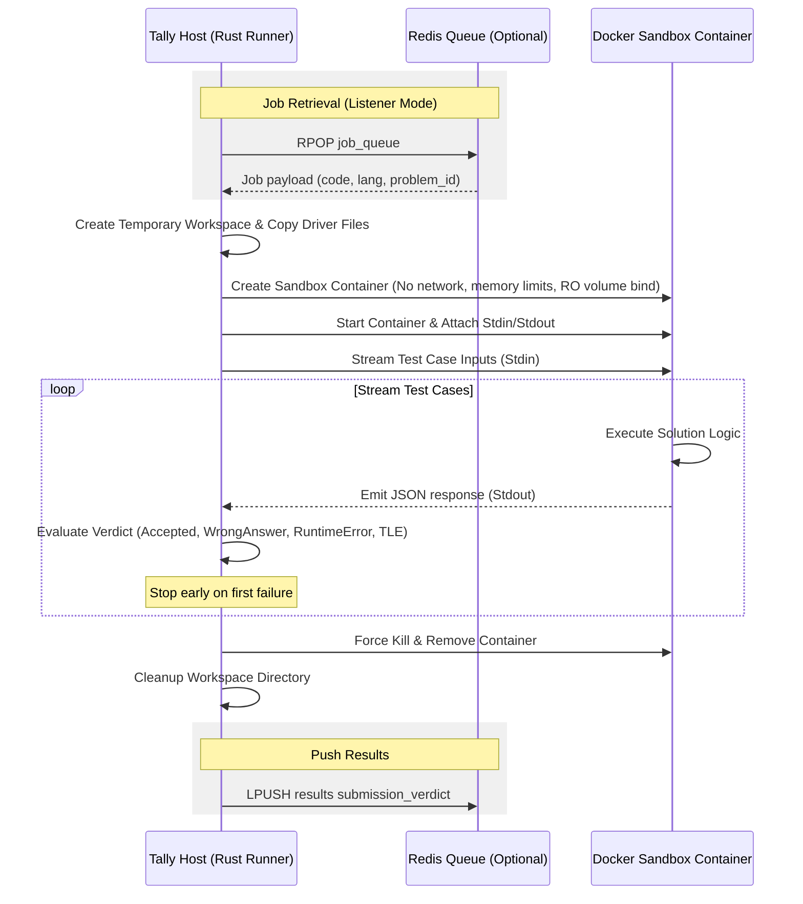

# Tally

[](https://www.rust-lang.org/)
[-yellow?style=flat-square)](#)
[](https://www.docker.com/)
[](#)


Tally is a high-performance, secure, Docker-based code execution sandbox and online judger built in Rust. It compiles, runs, and evaluates user submissions in isolated environments against predefined test cases.

Tally is designed to support multiple programming languages (Python, Java, C, and C++) while maintaining strict security constraints (such as absolute memory limits, disabled internet access, read-only workspaces, and execution timeouts).

---

## Features

- **Multi-Language Support**: Run solutions in **Python 3**, **Java**, **C**, and **C++**.
- **Secure Sandboxing**:
  - **Memory Limits**: Hard-capped container memory limit (default: 512 MB) and disabled swap.
  - **Network Isolation**: Complete network isolation (`network_mode: none`) to prevent network calls from user solutions.
  - **Read-Only Mounting**: Solutions are mounted as read-only (`ro`) to prevent unauthorized modifications of the host file system.
- **Dual Execution Modes**:
  - **Direct CLI Mode**: Execute a single solution file locally against a test suite stored in a JSON/JSONL file.
  - **Redis Listener Mode**: Run as a daemon worker subscribing to a Redis job queue (`rpop`) and pushing results back to a results queue (`lpush`).
- **Optimal Judge Optimization**:
  - **Early Stopping**: Execution aborts immediately upon the first non-Accepted verdict, reducing compute time.
  - **Interactive I/O Streaming**: Stream inputs directly to container `stdin` and read outputs sequentially from `stdout` for efficient judging.

---

## Project Structure

```text
├── Cargo.toml            # Project dependencies & package metadata
├── Makefile              # Helper to stop/remove all docker containers
├── code_tests/           # Folder containing JSONL test cases for problems
│   ├── climbing-stairs.jsonl
│   ├── house-robber.jsonl
│   └── ...
├── src/
│   ├── main.rs           # (Implicitly loaded as lib & bin binaries)
│   ├── lib.rs            # Core module declarations (judger, models, runner)
│   ├── models.rs         # Data schemas for Jobs, Verdicts, Test Cases, and Results
│   ├── runner.rs         # Orchestrator managing Docker container life cycles and IO streams
│   ├── judger.rs         # Verifier checking solution output against expected results
│   ├── bin/
│   │   ├── runner.rs     # Main entry point (supporting CLI and Listener modes)
│   │   └── test_gen.rs   # Helper to generate test boilerplate
│   ├── c_driver/         # C boilerplate, dynamic loader, and JSON parses (cJSON)
│   ├── cpp_driver/       # C++ boilerplate and JSON library (json.hpp)
│   ├── java_driver/      # Java boilerplate driver and dependency library
│   └── python_driver/    # Python boilerplate driver
└── tests/
    └── integration.rs    # Integration test suite validating Docker container execution
```

---

## Architectural Workflow

The following diagram highlights the execution lifecycle of a submission:



---

## Prerequisites

1. **Rust**: Install Rust (Edition 2024 is required).
   ```bash
   curl --proto '=https' --tlsv1.2 -sSf https://sh.rustup.rs | sh
   ```
2. **Docker**: Ensure Docker is installed and running. Tally communicates with Docker via the socket at Unix socket: `/var/run/docker.sock`.
3. **Redis** *(Optional)*: Required only if running in Redis Listener Mode.

---

## Setup & Running

### 1. Direct CLI Mode

Run a local solution file directly against a JSON test case file.

```bash
# Run a Python solution for two-sum
cargo run --bin runner -- \
  --code src/python_driver/solution.py \
  --tests two-sum.jsonl \
  --language python \
  --method-name twoSum
```

#### CLI Options
* `--code` / `-c`: Path to your solution source file.
* `--tests` / `-t`: Filename of the JSON/JSONL test cases in the `code_tests/` folder (defaults to `two_sum.jsonl`).
* `--language`: Submission language (`python`, `java`, `c`, `cpp`).
* `--method-name`: The function/method name to run inside the solution (e.g. `twoSum`).
* `--type-schema`: Optional schema mapping for C dynamic types (e.g. `"[i],i:[i]"`).

---

### 2. Redis Listener Mode

Listen continuously for execution jobs pushed to a Redis queue.

```bash
cargo run --bin runner -- \
  --listen-queue jobs \
  --redis-url redis://127.0.0.1:6379/
```

#### Redis Job Payload Schema
Jobs pushed to the Redis queue should match the following JSON envelope format:

```json
{
  "problem_id": 1,
  "problem_slug": "two-sum",
  "language": "python",
  "method_name": "twoSum",
  "type_schema": null,
  "code": "class Solution:\n    def twoSum(self, nums: List[int], target: int) -> List[int]:\n        ...\n",
  "user": "developer123"
}
```

The runner evaluates the job and publishes the output back to the Redis list named `results`.

---

## Security Limits

Containers are built and run with strict security boundaries:
- **Memory Boundary**: `512 MB` RAM ceiling.
- **CPU limits**: Configurable (Docker host defaults).
- **Networking**: Disabled (`network_mode: none`).
- **Disk I/O**: The workspace containing driver and solution files is mounted read-only (`ro`). Solutions cannot modify filesystem components on the host.
- **Timeout**: The host sets a standard `30` second TLE (Time Limit Exceeded) cutoff.

---

## Testing

Integration tests require Docker to be running locally on your system. Run integration tests in single-thread mode to prevent resource contention:

```bash
cargo test -- --test-threads=1
```

To clean up stopped or dangling Docker containers created during test failures or manual interruptions:

```bash
make clean
```

---

## Contributing

We welcome contributions! Please follow these guidelines:

1. **Conventional Commits**: Format commits as `<type>(<scope>): <description>` (e.g., `feat(runner): add Go support`). Common types: `feat`, `fix`, `docs`, `refactor`, `test`, `chore`.
2. **Formatting & Linting**: Run standard Rust check commands:
   ```bash
   cargo fmt --check
   cargo clippy -- -D warnings
   ```
3. **Testing**: Verify changes pass the test suite:
   ```bash
   cargo test -- --test-threads=1
   ```
4. **Pull Requests**: Submit descriptive pull requests from branches on your fork.


